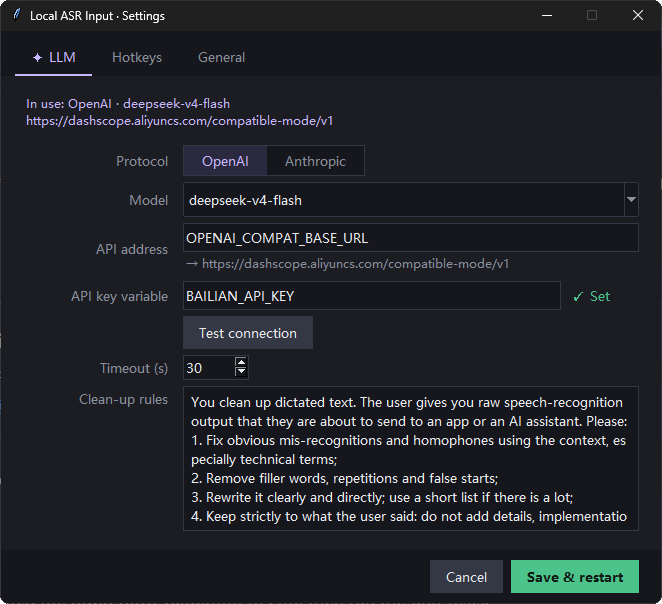
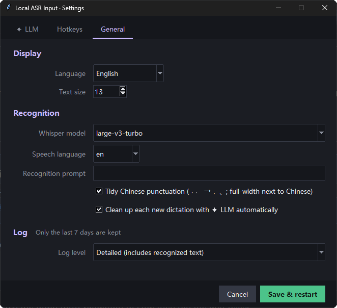

# Local ASR Input · 本声

**English** | [简体中文](README.zh-CN.md) · Mirror in China: [Gitee](https://gitee.com/larntin/local-asr-input)

**Free, open-source, local-first voice input for Windows.**
Press a hotkey and speak. Your speech is transcribed on your own machine by [faster-whisper](https://github.com/SYSTRAN/faster-whisper), you fix any mistakes in a small popup, and one key pastes the text into whatever window you were in: terminal, editor, chat box, anything.
Transcription costs nothing and your audio never leaves your computer. Optionally, any LLM can tidy up the text for you (both OpenAI and Anthropic APIs are supported).

<p align="center">
  <br>
  <sub>Record → transcribe → ✦ LLM clean-up → press Enter to insert</sub>
</p>

## Features

- **Local speech recognition**: faster-whisper runs on your own computer, on the GPU if you have an NVIDIA card and on the CPU otherwise. Audio stays in memory and is discarded after transcription; nothing is written to disk or uploaded.
- **Cloud recognition (optional)**: no GPU, or want even better accuracy? Switch the speech engine to a cloud API: Alibaba Bailian `qwen3-asr-flash`, OpenAI `whisper-1`, or anything that speaks OpenAI's `/audio/transcriptions`.
- **Review before sending**: the transcription appears in a popup first. Fix words, keep talking, add line breaks, and only then insert it, so mistakes never land in your terminal.
- **Pastes into the original window**: it remembers which window you were in when you pressed the hotkey, switches back and pastes via the clipboard. Works with PowerShell, Windows Terminal, VS Code, browsers and more.
- **✦ LLM clean-up (optional)**: turns rambling speech into clear text and fixes mis-heard words. Works with **OpenAI**- and **Anthropic**-compatible APIs, so most model providers just need a URL and a key. Ctrl+Z restores the original.
- **Everything is configurable**: hotkeys (just press the keys you want), text size, Whisper model, LLM protocol / model / clean-up rules, all in ⚙ Settings.
- **English and Chinese interface**: follows your Windows language by default; switch it in ⚙ Settings → General → Language.
- **Stays out of the way**: a borderless dark popup that shows status with icons and colors only; lives in the system tray, runs as a single instance, and keeps 7 days of logs.

## Installation

### Download (recommended)

1. Get `LocalASRInput-v*-win64.zip` from [Releases](https://github.com/larntin/local-asr-input/releases) and unzip it anywhere.
2. Run `LocalASRInput.exe`. A microphone icon appears in the system tray; `config.json` and the log are created next to the exe.
3. The first run downloads the Whisper model (`large-v3-turbo`, about 1.6 GB) from Hugging Face. If that is slow or blocked, run `setx HF_ENDPOINT https://hf-mirror.com` once and start the app again, or switch to a cloud speech engine in ⚙ Settings.

**GPU**: with an NVIDIA card and the CUDA 12 runtime (cuBLAS) installed, recognition runs on the GPU; otherwise it falls back to the CPU automatically, which works but is slower. On PCs without a GPU, the cloud speech engine is the fastest option.

### From source

Requires **Windows 10/11** and **Python 3.10+**.

```bash
git clone https://github.com/larntin/local-asr-input.git
cd local-asr-input
pip install -r requirements.txt
```

Start it by double-clicking `start.bat` (runs in the background; look for the microphone icon in the system tray), or with `python local_asr_input.py` (with a console, handy for watching the log).


## Usage

| Key | Action |
|---|---|
| **F9** | Start recording; press again to stop and transcribe. With the popup open, press again to keep talking (inserted at the cursor) |
| **Enter** | Insert: paste into the window you were in when you pressed F9 (no Enter is sent; you press it yourself) |
| **Shift+Enter** | New line |
| **Ctrl+L** / click ✦ | Clean up the text with the LLM (Ctrl+Z to undo) |
| **Esc** | Cancel (during LLM clean-up: abandon the clean-up) |
| **Ctrl+Alt+F9** | Quit (or right-click the tray icon) |

All of these can be changed in ⚙ Settings: click a box, then press the key combination you want.

**Status at a glance**, shown at the bottom left and in the colored strip along the bottom edge:

| Looks like | Meaning |
|---|---|
| Red bouncing level bars | Recording |
| Orange moving blocks | Transcribing |
| Purple moving blocks | LLM clean-up in progress |
| Green dot | Ready to edit and insert |
| Grey ring | Nothing recognized, or too short |
| Red ring | Something went wrong (see the log) |

## Settings

Click ⚙ at the bottom right of the popup, or right-click the tray icon and choose Settings. Saving restarts the app automatically (about 4 seconds).

<p align="center">
  
  
</p>

### Cloud speech recognition (optional)

In ⚙ Settings → General, set **Speech engine** to **Cloud API**, then fill in:

| API type | Works with | Example |
|---|---|---|
| Chat API with audio | Alibaba Bailian Qwen3-ASR | `https://dashscope.aliyuncs.com/compatible-mode/v1`, model `qwen3-asr-flash` |
| OpenAI transcription API (`/audio/transcriptions`) | OpenAI, Groq and other OpenAI-compatible services | `https://api.openai.com/v1`, model `whisper-1` |

The API address and key work the same way as for the LLM (a URL or an environment variable name; the key always lives in an environment variable). Click **Test connection** before saving. In cloud mode the local Whisper model isn't loaded at all, so the app starts instantly and needs no GPU.

### Connecting an LLM (optional)

Everything works without an LLM; you just won't have ✦ clean-up. To set it up:

1. Get an **API address** and an **API key** from any model provider (OpenAI, Anthropic, DeepSeek, Alibaba Bailian, Volcengine Ark, Tencent Hunyuan, and so on).
2. Put the key in an **environment variable** (keys are never written to the config file), for example:
   ```bash
   setx MY_LLM_API_KEY "sk-your-key"
   ```
3. In ⚙ Settings → ✦ LLM, pick the protocol (OpenAI or Anthropic) and fill in the model name, the API address (a URL, or the name of an environment variable that holds the URL) and the name of the variable holding your key. Click **Test connection** to check it, then save.

Each protocol keeps its own settings, so switching back and forth doesn't overwrite anything. Examples:

| Provider | Protocol | API address |
|---|---|---|
| OpenAI | OpenAI | `https://api.openai.com/v1` |
| Anthropic | Anthropic | `https://api.anthropic.com` |
| Alibaba Bailian | OpenAI | `https://dashscope.aliyuncs.com/compatible-mode/v1` |
| Alibaba Bailian | Anthropic | `https://dashscope.aliyuncs.com/apps/anthropic` |

"Clean up each new dictation with ✦ LLM automatically" is on by default. It only processes the newly dictated part, skips very short text, and **is skipped entirely when no LLM is set up**, so nothing is sent anywhere.

## Privacy

- With the default local engine, audio stays in memory and is transcribed on your PC. It is never written to disk or uploaded.
- If you switch the speech engine to **Cloud API**, each recording is sent to the provider you configured.
- Only when ✦ LLM clean-up is used is the recognized **text** sent to the provider you configured.
- By default the log includes the recognized text, which helps with troubleshooting. If you'd rather not, set ⚙ Settings → General → Log level to "Errors and warnings only". Logs are kept for 7 days.

## Configuration file

All settings live in `config.json` next to the program (created on first run, with a `_help` section). ⚙ Settings is the easiest way to change them.

## Development

```bash
python tests/run_all.py     # tests
pip install pyinstaller
python build.py             # builds dist/LocalASRInput-v<version>-win64.zip
```

The tests briefly open windows but never send real keystrokes. `test_llm` / `test_auto_llm` / `test_protocol` make real LLM calls and need the environment variables `OPENAI_COMPAT_BASE_URL` and `BAILIAN_API_KEY` (Alibaba Bailian); they are skipped when those aren't set.

To add a language, add a translation for every entry in `STRINGS` and `CONFIG_HELP` in `i18n.py` and register it in `UI_LANGUAGES`.

## Roadmap

- [x] Cloud speech recognition (URL + key), for PCs without a GPU
- [x] A packaged `.exe`: download and run, no Python needed
- [x] Gitee mirror: https://gitee.com/larntin/local-asr-input

## License

[MIT](LICENSE)
