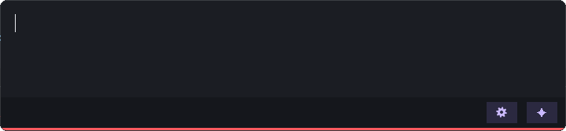
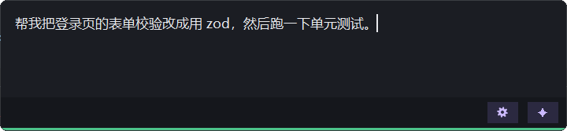

# 本声 · Local ASR Input

[English](README.md) | **简体中文**

**免费、开源、本地识别的 Windows 语音输入工具。**
按一下热键说话，本机 [faster-whisper](https://github.com/SYSTRAN/faster-whisper) 离线识别，在弹窗里改好错字，一键上屏到任意窗口：终端、编辑器、聊天框都行。
识别不花钱、录音不出本机；想让文字更规整，可以接上任意大模型自动整理（OpenAI / Anthropic 两种协议都支持）。

<p align="center">
  <br>
  
</p>

## 特点

- **本地识别**：faster-whisper 跑在自己电脑上，有 NVIDIA 显卡自动用 GPU，没有就用 CPU。录音只在内存里，识别完即丢弃，不写硬盘、不上传。
- **先看后发**：识别结果先出现在弹窗里，可以改错字、接着说、换行，确认后才上屏，不会把错字直接打进终端。
- **上屏到原窗口**：按热键时记住你所在的窗口，确认后切回去用剪贴板粘贴，PowerShell / Windows Terminal / VS Code / 浏览器都能用。
- **✦ LLM 整理（可选）**：把口述内容整理成清晰的文字，顺手修正同音错字（如「单立」→「单例」）。支持 **OpenAI** 和 **Anthropic** 两种协议，各模型平台的接口地址 + Key 填上就能用；Ctrl+Z 一步撤回原文。
- **中文友好**：自动整理标点（`﹐﹑` → `，、`，挨着中文的英文标点转全角，代码里的不动）。
- **全部可配置**：快捷键（直接按键录入）、字号、Whisper 模型、LLM 协议 / 模型 / 整理规则，都在 ⚙ 设置里。
- **中英双语界面**：默认跟随系统语言，也可以在 ⚙ 设置 → 常规 → 界面语言里切换。
- **安静省心**：无边框深色弹窗，状态全靠图标和颜色；托盘常驻、只允许一个实例；日志按天轮转只留 7 天。

## 安装

需要 **Windows 10/11**、**Python 3.10+**。有 NVIDIA 显卡（CUDA 12）会快很多，没有也能用 CPU 跑。

```bash
git clone https://github.com/larntin/local-asr-input.git
cd local-asr-input
pip install -r requirements.txt
```

启动：双击 `start.bat`（后台运行，看右下角托盘的麦克风图标），或者 `python local_asr_input.py`（带控制台，方便看日志）。

第一次运行会从 HuggingFace 下载 Whisper 模型（`large-v3-turbo` 约 1.6GB）。国内网络下载不动时，可以设置镜像后再启动：

```bash
set HF_ENDPOINT=https://hf-mirror.com
```

## 使用

| 按键 | 作用 |
|---|---|
| **F9** | 开始录音；再按一次结束录音并识别。弹窗开着时再按 = 接着说，插到光标处 |
| **Enter** | 上屏：粘贴到按 F9 时所在的窗口（不回车，回车你自己按） |
| **Shift+Enter** | 换行 |
| **Ctrl+L** / 点 ✦ | 用 LLM 整理文本框里的内容（Ctrl+Z 撤回） |
| **Esc** | 取消（LLM 整理中按 = 放弃这次整理） |
| **Ctrl+Alt+F9** | 退出程序（也可以托盘右键退出） |

以上快捷键都可以在 ⚙ 设置里改：点一下输入框，直接按下想要的组合键。

**状态看图标**：左下角 + 窗口底边的色带

| 样子 | 状态 |
|---|---|
| 红色跳动的音量条 | 录音中 |
| 橙色流动小块 | 识别中 |
| 紫色流动小块 | LLM 整理中 |
| 绿色圆点 | 可以编辑、上屏 |
| 灰色空心圈 | 没识别到内容 / 太短 |
| 红色空心圈 | 出错了（详见日志） |

## 设置

点弹窗右下角的 ⚙，或托盘右键「设置」。保存后程序自动重启生效（约 4 秒）。

<p align="center">
  
  
</p>

### 接入大模型（可选）

不配置也完全能用，只是没有 ✦ 整理功能。配置方法：

1. 在模型平台拿到**接口地址**和 **API Key**（阿里百炼、火山方舟、腾讯混元、DeepSeek、OpenAI、Anthropic 等都可以）。
2. 把 Key 放进一个**环境变量**（Key 不会写进配置文件），例如：
   ```bash
   setx BAILIAN_API_KEY "sk-你的key"
   ```
3. 在 ⚙ 设置 → ✦ LLM 里选协议（OpenAI / Anthropic），填模型名、接口地址（可以直接填 URL，也可以填存放 URL 的环境变量名）、Key 所在的环境变量名，点「测试连接」确认能通，再保存。

两种协议各自保存一套配置，切换不会互相覆盖。以阿里百炼为例：

| 协议 | 接口地址 |
|---|---|
| OpenAI | `https://dashscope.aliyuncs.com/compatible-mode/v1` |
| Anthropic | `https://dashscope.aliyuncs.com/apps/anthropic` |

「识别完成后自动用 LLM 整理」默认开启：只整理新说的那一段，少于 6 个字的不整理；**没配置好 LLM 时自动跳过**，什么也不会发出去。

## 隐私

- 录音只在内存里，识别在本机完成，不写硬盘、不上传。
- 只有开启了 ✦ LLM 整理时，识别出的**文字**才会发给你配置的模型平台。
- 日志默认会记录识别出的文字，方便排查问题；介意的话在 ⚙ 设置 → 常规 → 日志级别选「仅错误和警告」。日志只保留最近 7 天。

## 配置文件

所有设置保存在程序目录的 `config.json`（第一次运行自动生成，里面有 `_说明`）。一般用 ⚙ 设置改就行，不用手动编辑。

## 开发

```bash
python tests/run_all.py
```

测试会短暂弹出窗口，但不会模拟真实按键。`test_llm` / `test_auto_llm` / `test_protocol` 会真实调用 LLM，需要环境变量 `OPENAI_COMPAT_BASE_URL` 和 `BAILIAN_API_KEY`，没有时自动跳过。

## 计划

- [ ] 云端语音识别：接入各平台的语音识别接口（填 URL + Key），没有显卡的电脑也能又快又准
- [ ] 打包成 exe，下载即用，不用装 Python
- [ ] Gitee 镜像

## 许可证

[MIT](LICENSE)
